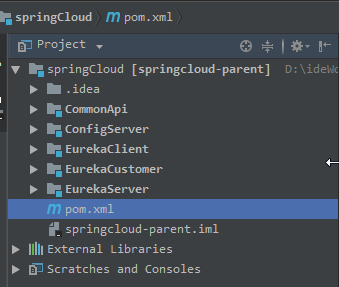

# 微服务

定义（特征）：

​	马丁富乐（创始人）：

​		微服务就是**将一个单一的应用分为多个小型微服务的架构**，

​		**每个服务运行在单独的进程中**，

​		**每个微服务只关注特定的业务功能**，

​		服务于服务之间**通过HTTP请求等轻量的通信机制实现服务间通信**，

​		这些服务可以**通过独立的部署机制进行全自动部署**，

​		共用一个小型的集中管理中心，

​		**可以用不同的编程语言、不同的数据库**

# Spring Cloud

## 定义

​	是基于Spring Boot的一整套实现微服务的框架。他提供了微服务开发所需的配置管理、服务发现、断路器、智能路由、微代理、控制总线、全局锁、决策竞选、分布式会话和集群状态管理等组件

## 组成


### Netflix

**针对多种Netflix组件提供的开发工具包，其中包括Eureka、Hystrix、Zuul、Archaius等。**

### Netflix Eureka

**一个基于rest服务的服务治理组件，包括服务注册中心、服务注册与服务发现机制的实现，实现了云端负载均衡和中间层服务器的故障转移。**

#### Netflix Eureka Server

能干啥：

​	那么多微服务组件总要有一个服务调度中心，起到统一管理的作用，各个微服务想要发挥一定 的作用必须注册在服务中心

怎么玩：

- ​	创建一个父的空工程（只有pom文件和.idea文件夹）

  

  ```xml
  <?xml version="1.0" encoding="UTF-8"?>
  <project xmlns="http://maven.apache.org/POM/4.0.0" xmlns:xsi="http://www.w3.org/2001/XMLSchema-instance"
  		 xsi:schemaLocation="http://maven.apache.org/POM/4.0.0 http://maven.apache.org/xsd/maven-4.0.0.xsd">
  	<modelVersion>4.0.0</modelVersion>

  	<groupId>cn.hgf</groupId>
  	<artifactId>parent</artifactId>
  	<version>0.0.1-SNAPSHOT</version>
  	<packaging>pom</packaging>

  	<name>parent</name>
  	<description>Demo project for Spring cloud</description>

  	<parent>
  		<groupId>org.springframework.boot</groupId>
  		<artifactId>spring-boot-starter-parent</artifactId>
  		<version>2.0.4.RELEASE</version>
  		<relativePath/>
  	</parent>

  	<properties>
  		<project.build.sourceEncoding>UTF-8</project.build.sourceEncoding>
  		<project.reporting.outputEncoding>UTF-8</project.reporting.outputEncoding>
  		<java.version>1.8</java.version>
  		<spring-boot.version>2.0.4.RELEASE</spring-boot.version>
  		<spring-cloud.version>Finchley.RELEASE</spring-cloud.version>
  		<lombok.version>1.16.18</lombok.version>
  	</properties>

    	<!-- 如果子pom文件使用其中的依赖不需要声明版本，起到版本同一作用 -->
  	<dependencyManagement>
  		<dependencies>

  			<dependency>
  				<groupId>org.springframework.cloud</groupId>
  				<artifactId>spring-cloud-dependencies</artifactId>
  				<version>${spring-cloud.version}</version>
  				<type>pom</type>
  				<scope>import</scope>
  			</dependency>
  			<!-- 第三方插件，简化get、set方法等 -->
  			<dependency>
  				<groupId>org.projectlombok</groupId>
  				<artifactId>lombok</artifactId>
  				<version>${lombok.version}</version>
  			</dependency>

  			<dependency>
  				<groupId>org.springframework.boot</groupId>
  				<artifactId>spring-boot-starter-web</artifactId>
  				<version>${spring-boot.version}</version>
  			</dependency>

  		</dependencies>
  	</dependencyManagement>

  	<dependencies>
  		<dependency>
  			<groupId>org.springframework.boot</groupId>
  			<artifactId>spring-boot-starter</artifactId>
  			<version>${spring-boot.version}</version>
  		</dependency>

  		<dependency>
  			<groupId>org.springframework.boot</groupId>
  			<artifactId>spring-boot-configuration-processor</artifactId>
  			<version>${spring-boot.version}</version>
  			<optional>true</optional>
  		</dependency>

  		<dependency>
  			<groupId>org.springframework.boot</groupId>
  			<artifactId>spring-boot-starter-test</artifactId>
  			<version>${spring-boot.version}</version>
  			<scope>test</scope>
  		</dependency>

  	</dependencies>

  	<build>
  		<plugins>
  			<plugin>
  				<groupId>org.springframework.boot</groupId>
  				<artifactId>spring-boot-maven-plugin</artifactId>
  			</plugin>
  		</plugins>
  	</build>

  	<modules>
  		<module>EurekaClient</module>
  		<module>EurekaServer</module>
  		<module>CommonApi</module>
  		<module>EurekaCustomer</module>
  		<module>ConfigServer</module>
  	</modules>
  </project>

  ```

  ​	

- 创建一个Spring Boot 的Module，使其继承上面的pom

  ```xml
  <modelVersion>4.0.0</modelVersion>

  	<artifactId>EurekaServer</artifactId>
  	<version>0.0.1-SNAPSHOT</version>
  	<packaging>jar</packaging>

  	<name>EurekaServer</name>
  	<description>spring cloud server</description>

  	<parent>
  		<groupId>cn.hgf</groupId>
  		<artifactId>parent</artifactId>
  		<version>0.0.1-SNAPSHOT</version>
  	</parent>

  	<properties>
  		<project.build.sourceEncoding>UTF-8</project.build.sourceEncoding>
  		<project.reporting.outputEncoding>UTF-8</project.reporting.outputEncoding>
  		<java.version>1.8</java.version>
  	</properties>

  	<dependencies>
        	<!-- 声明为服务注册中心依赖（maven官方推荐使用netflix的） -->
  		<dependency>
  			<groupId>org.springframework.cloud</groupId>
  			<artifactId>spring-cloud-starter-netflix-eureka-server</artifactId>
  		</dependency>
  	</dependencies>
  ```

  ​

- ​

### Config（配置管理）

**官网定义**：由git存储库支持的集中式外部配置管理。配置资源直接映射到Spring `Environment`

**能干啥**：

​		在分布式系统中，由于服务数量巨多，为了方便服务配置文件统一管理，实时更新，所以需要分布式配置中心组件。支持git和本地存储（内存）统一的配置文件

​		有两个角色：config server（配置服务中心）、config client（配置使用）

​		通俗讲就是config server服务组件将配置文件的信息从git（本地）拉取配置然后以供config client使用


**怎么玩**：


​	